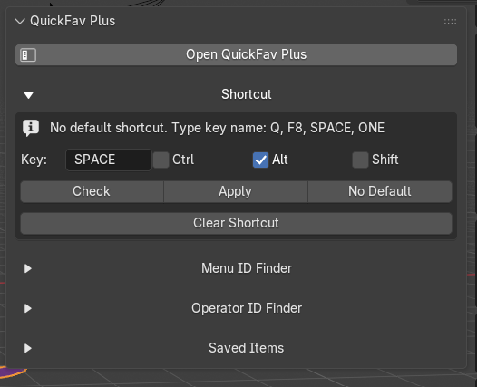
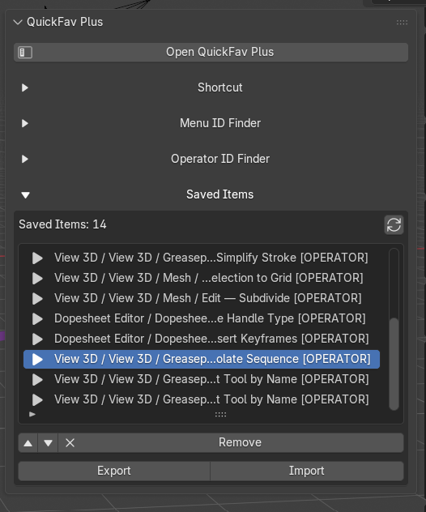
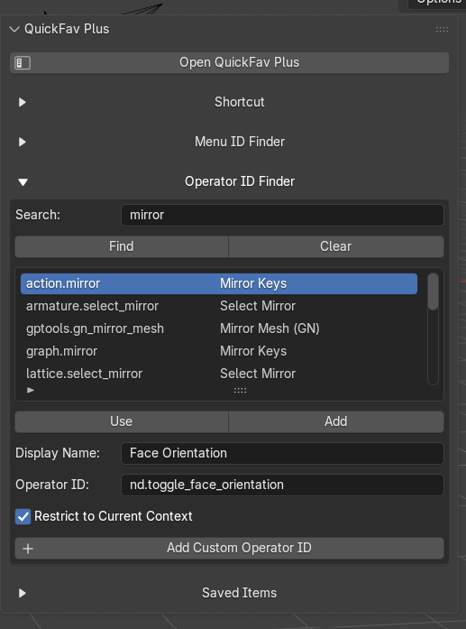
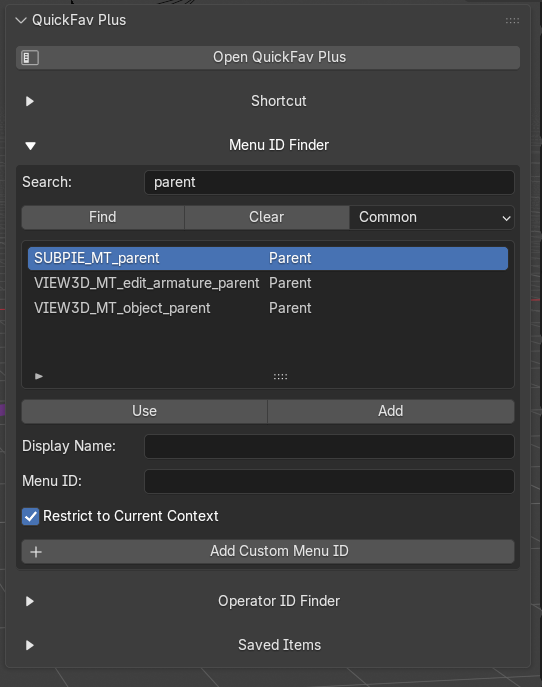

# QuickFav Plus

**QuickFav Plus** is a Blender extension that adds a user-managed quick menu for frequently used Blender commands and parent menus.

It is designed to work like Blender’s Quick Favorites concept, but with more control over how saved items are added, arranged, filtered, exported, and reused.

QuickFav Plus does **not** replace Blender’s built-in Quick Favorites automatically. It provides a separate customizable popup menu. Users can choose to keep Blender’s default Quick Favorites or manually bind QuickFav Plus to the same `Q` key.

---

## Features

- Separate QuickFav Plus popup menu
- User-defined shortcut
- Shortcut conflict checker
- Right-click add/remove for supported Blender command buttons
- Menu ID Finder for adding Blender parent menus/submenus
- Operator ID Finder for adding Blender operators manually
- Context-aware filtering
- Saved-items manager in the sidebar
- Move saved items up/down
- Remove highlighted saved item
- Import/export saved QuickFav Plus list as JSON
- No default shortcut assigned, so users choose their own preferred keybind

---

## Why QuickFav Plus Exists

Blender’s built-in Quick Favorites is useful, but it can become hard to organize as the list grows.

QuickFav Plus adds a more manageable workflow:

```text
Direct command buttons  → Right-click add/remove
Parent menus/submenus   → Find and add by Menu ID
Operators               → Find and add by Operator ID
Saved items             → Arrange from the sidebar
```

This gives users more control without depending on Blender’s internal Quick Favorites data.

---

## Installation

1. Download the extension ZIP file.
2. Open Blender.
3. Go to:

```text
Edit → Preferences → Extensions
```

4. Choose:

```text
Install from Disk
```

5. Select the QuickFav Plus ZIP file.
6. Enable the extension.

After enabling it, open the 3D View sidebar:

```text
N-panel → QuickFav+
```

---

## Screenshot









---

## Opening QuickFav Plus

QuickFav Plus does **not** assign a shortcut by default.

This avoids conflicts with Blender’s existing shortcuts and other add-ons.

To open the menu without a shortcut:

```text
N-panel → QuickFav+ → Open QuickFav Plus
```

To assign a shortcut:

1. Open:

```text
N-panel → QuickFav+
```

2. In the **Shortcut** section, type a key name.
3. Optional: enable `Ctrl`, `Alt`, or `Shift`.
4. Click **Check** to detect conflicts.
5. Click **Apply**.

Example shortcut values:

```text
Q
F8
F10
SPACE
ONE
TWO
NUMPAD_1
```

Blender uses internal key names. For number keys, use names such as:

```text
ONE
TWO
THREE
```

instead of:

```text
1
2
3
```

Some aliases are supported by the extension, so typing `1`, `2`, or `3` may be converted internally to Blender’s key names.

---

## Optional: Use `Q` for QuickFav Plus

By default, Blender already uses `Q` for its built-in Quick Favorites menu.

If you want `Q` to open QuickFav Plus instead, you can manually remove or disable Blender’s default Quick Favorites shortcut and then assign `Q` to QuickFav Plus.

### Steps

1. Open Blender Preferences:

```text
Edit → Preferences
```

2. Go to:

```text
Keymap
```

3. Search for:

```text
quick
```

4. Find Blender’s default **Quick Favorites** shortcut.
5. Remove, disable, or change the default `Q` binding.
6. Open:

```text
N-panel → QuickFav+
```

7. In the QuickFav Plus shortcut field, type:

```text
Q
```

8. Click:

```text
Check
```

9. If the conflict is gone, click:

```text
Apply
```

After that:

```text
Q → QuickFav Plus
```

This is optional. If you still want Blender’s default Quick Favorites, use a different shortcut for QuickFav Plus.

---

## Shortcut Conflicts

Blender uses many shortcuts by default. Other extensions may also register their own shortcuts.

QuickFav Plus includes a conflict checker. If a conflict is found, it will list possible matching shortcuts.

A conflict warning does not always mean the shortcut is impossible to use, but it means another Blender command or add-on may also respond to the same key combination.

QuickFav Plus does **not** remove or override other shortcuts automatically.

---

## Adding Direct Commands

For normal Blender command buttons:

1. Right-click the command button.
2. Choose:

```text
Add to QuickFav Plus
```

If the item is already saved, the right-click menu may show:

```text
Remove from QuickFav Plus
```

This works for direct command/operator buttons that Blender exposes to add-ons.

---

## Adding Parent Menus and Submenus

Some Blender parent menus cannot be captured through right-click by add-ons, even though Blender’s default Quick Favorites may support them.

For those menus, use the built-in **Menu ID Finder**.

Example workflow:

```text
N-panel → QuickFav+ → Menu ID Finder
```

Search for a menu, for example:

```text
mirror
mesh
vertex
snap
transform
```

Then select the result and click:

```text
Add
```

Examples of Blender menu IDs:

```text
VIEW3D_MT_mirror
VIEW3D_MT_transform
VIEW3D_MT_snap
VIEW3D_MT_edit_mesh
VIEW3D_MT_edit_mesh_vertices
VIEW3D_MT_edit_mesh_edges
VIEW3D_MT_edit_mesh_faces
```

QuickFav Plus uses Blender’s own menu classes. It does not recreate the child menu items manually.

---

## Adding Operators Manually

Use the **Operator ID Finder** to search Blender operators.

Example workflow:

```text
N-panel → QuickFav+ → Operator ID Finder
```

Search examples:

```text
shade
mirror
extrude
delete
keyframe
```

Example operator IDs:

```text
object.shade_smooth
object.shade_flat
mesh.bevel
mesh.extrude_region_move
wm.save_as_mainfile
```

Select the operator and click:

```text
Add
```

---

## Context-Aware Filtering

QuickFav Plus stores context information for saved items.

This helps show items only where they are relevant.

The saved context may include:

```text
Area type
Space type
Object type
Object mode
```

For example, an item added in Edit Mode can be shown only in Edit Mode, while an item added from a timeline or another editor can be tied to that area.

For manually added menu IDs and operator IDs, the sidebar includes a context restriction option.

If you want an item to show in more places, disable:

```text
Restrict to Current Context
```

before adding it.

---

## Managing Saved Items

The sidebar includes a saved-items list.

You can:

- select/highlight an item
- move it up
- move it down
- remove it
- export the list
- import a previously exported list

The **Remove** button only removes the highlighted item.

There is no “Clear All” button to avoid accidental deletion of a complete saved setup.

---

## Import and Export

QuickFav Plus can export its saved list as a JSON file.

This is useful for:

- backups
- moving settings to another Blender installation
- sharing a QuickFav Plus setup
- preserving a workflow before testing changes

Use:

```text
Export
```

to save your list.

Use:

```text
Import
```

to load a saved list.

---

## Notes and Limitations

QuickFav Plus depends on what Blender exposes through its Python API.

Direct operators are usually easy to add by right-click.

Parent menus/submenus usually need to be added through the Menu ID Finder because Blender does not expose those parent menu entries to add-ons in the same way direct operator buttons are exposed.

If a saved command appears but Blender refuses to run it, that usually means Blender rejected it in the current mode, editor, or selection context.

---

## Recommended Workflow

A practical way to build your QuickFav Plus menu:

```text
1. Add common direct commands by right-clicking them.
2. Use Menu ID Finder for parent menus.
3. Use Operator ID Finder for commands that are hard to reach.
4. Arrange saved items in the sidebar.
5. Export the final setup as a backup.
6. Assign a shortcut that does not conflict with your workflow.
```

If you want QuickFav Plus to fully replace Blender’s default Quick Favorites workflow, manually remove Blender’s default `Q` binding for Quick Favorites and assign `Q` to QuickFav Plus.
